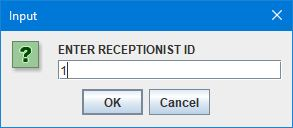
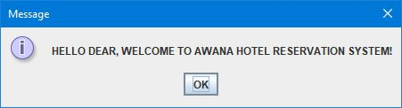
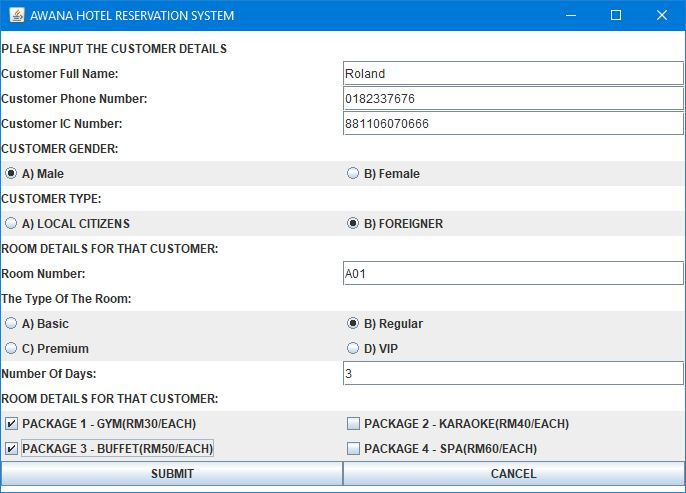
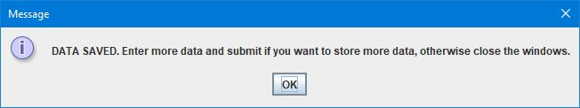
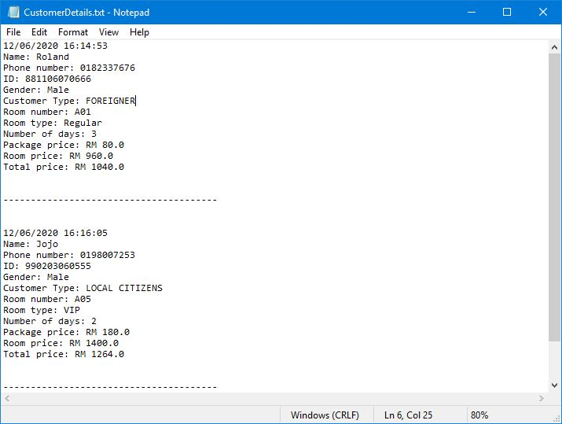
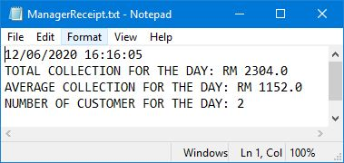

# Hotel-Reservation-System-v2
A Hotel Reservation System made with Java.

# How to use
1. Run HotelReservationSystem.java in any java compiler. (I use JCreator). 
    The windows will appear and press any number to proceed.
   
   
   
2. Click OK to proceed.                                                     
   

3. Fill in the form and press SUBMIT.                 
   
   
   
4. A window will pop up to indicates that the data is received and Press OK.
    You can enter as many data as you want.                                
   

6. The program will generate customerDetails.txt and managerReceipt.txt that contains the entered data.
   
   
